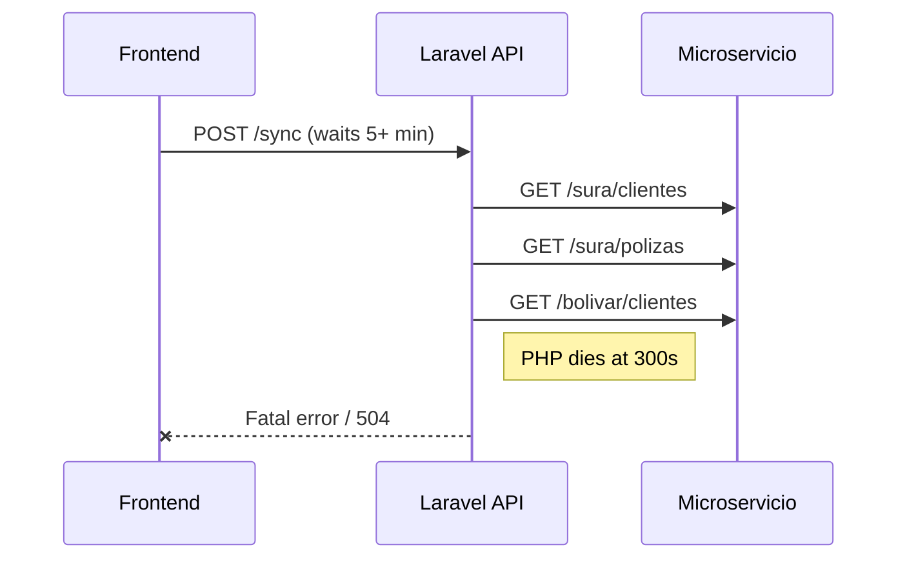
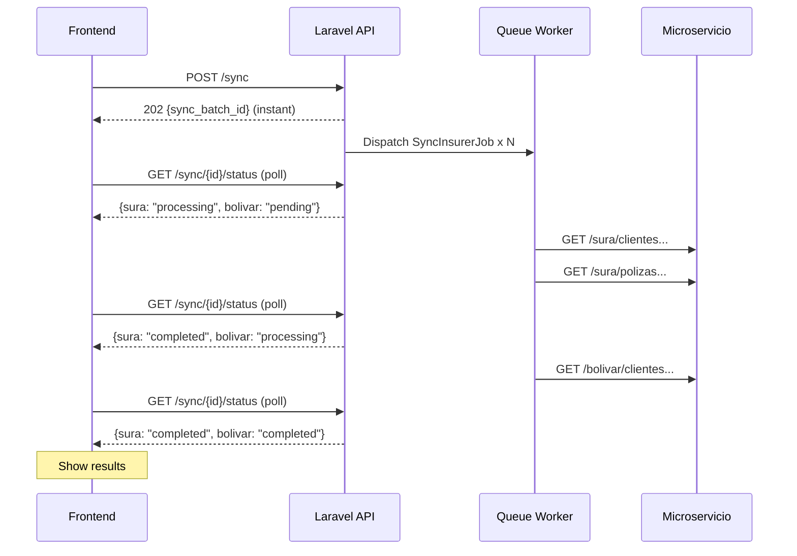

# Async Sync Architecture with Laravel Queues + Polling

## The Problem

Currently, when a user clicks "Sincronizar", the frontend makes **one long HTTP POST** that blocks until all insurers finish syncing (up to 300+ seconds). This causes:

- PHP `max_execution_time` fatal errors
- Nginx/Apache gateway timeouts (504)
- Browser `fetch` timeouts
- Impossible to scale to hundreds of daily users



## The Solution: Fire-and-Forget + Polling

The API accepts the sync request instantly (under 1 second), dispatches background jobs per insurer, and the frontend polls for progress.



## Infrastructure Available

- `QUEUE_CONNECTION=database` already configured
- `jobs` and `job_batches` tables already exist in the DB
- `queue:listen` already runs in the dev script (`composer.json`)
- No additional packages needed (no Horizon required for database driver)

## Backend Changes

### 1. New table: `sync_jobs` (tracks per-insurer progress)

A new migration creates a lightweight tracking table:

```
sync_jobs
- id (PK)
- batch_id (string, indexed) -- groups all insurers in one sync request
- broker_id (int, indexed)
- insurer_code (string)
- types (json) -- ["clientes","polizas","cartera"]
- status (enum: pending, processing, completed, failed)
- progress (json) -- {clientes: {created:5, updated:3...}, polizas: {...}, cartera: {...}}
- error (text, nullable)
- started_at (timestamp, nullable)
- completed_at (timestamp, nullable)
- timestamps
```

### 2. New Job: `App\Jobs\SyncInsurerJob`

- Implements `ShouldQueue`
- Each job handles **one insurer** (sura, bolivar, etc.)
- Updates `sync_jobs` row status to `processing` on start
- Calls existing `InsurerSyncService` methods (`syncClientes`, `syncPolizas`, `syncCartera`)
- Updates progress in `sync_jobs` after each type completes
- Marks `completed` or `failed` with results/error
- Uses `$tries = 2` and `$timeout = 600` (10 min per insurer)
- Uses `$backoff = 30` for retry

### 3. Modified Controller: `InsurerSyncController`

**`POST /sync`** changes from synchronous to:
- Validate request (same as now)
- Generate a `batch_id` (UUID)
- Create one `sync_jobs` row per insurer (status: `pending`)
- Dispatch one `SyncInsurerJob` per insurer to the queue
- Return immediately with `202 Accepted` + `{ batch_id }`

**New `GET /sync/{batchId}/status`** endpoint:
- Query all `sync_jobs` where `batch_id = $batchId`
- Return status per insurer + aggregated totals
- Include `overall_status`: `pending | processing | completed | partial | failed`

### 4. No changes to `InsurerSyncService`

The service logic stays exactly the same -- the Job just calls the same methods. The only difference is they now run in a queue worker process (which has no PHP timeout by default) instead of in an HTTP request.

## Frontend Changes

### 5. Updated `saasApi.ts`

- `syncInsurers()` now expects a `202` with `{ batch_id }`
- New method `getSyncStatus(batchId)` that calls `GET /sync/{batchId}/status`

### 6. Updated `Inicio.tsx` sync flow

- `startSync()` fires POST, gets `batch_id` instantly
- Enters polling loop (`setInterval` every 3 seconds)
- Each poll updates the UI per-insurer: shows which insurer is pending/processing/done
- The "syncing" stage now shows **real progress**: checkmarks appear per insurer as they complete
- When `overall_status` is `completed` or `failed`, stop polling and show results (same success screen)

### 7. Updated `CarteraAseguradoras.tsx` sync flow

Same polling pattern for the "Sincronizar cartera" button.

## Queue Worker for Production

For production, add a note in deployment that `php artisan queue:work --timeout=600 --tries=2` must be running (via Supervisor, systemd, or the hosting platform's worker). Locally, the existing `queue:listen` in `composer.json` handles it.

## Why This Approach

- **No new packages** -- uses Laravel's built-in database queue already configured
- **No infrastructure changes** -- `jobs` and `job_batches` tables already exist
- **Minimal code changes** -- the sync service stays untouched, only the controller and frontend change
- **Scales naturally** -- 100 users syncing = 100 jobs in the queue, processed sequentially (or add more workers later)
- **Graceful failures** -- each insurer fails independently, user sees exactly which one failed
- **Real-time progress** -- user sees per-insurer status instead of staring at a spinner for 5 minutes
