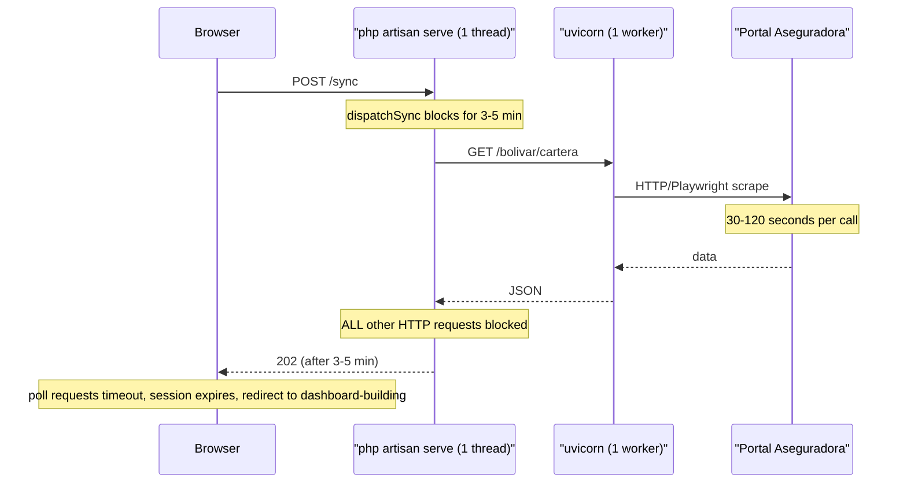
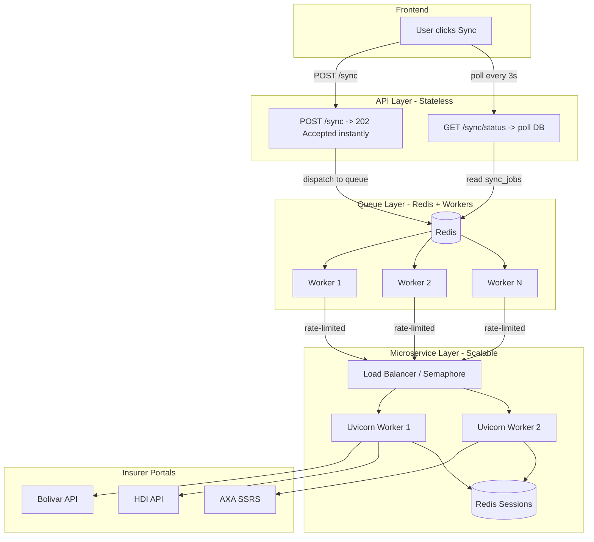
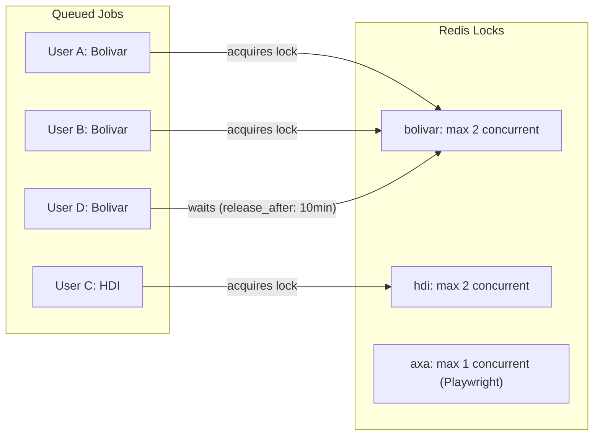

# Sync Architecture Overhaul for Production Scale

## The Problem Today

The current flow is fundamentally broken for multi-user:




**Why it fails at scale:**

- `php artisan serve` is single-threaded -- one sync blocks ALL users
- Even with PHP-FPM + Nginx, `dispatchSync` ties up a PHP worker for minutes
- The microservice has one worker, one Playwright browser, in-memory sessions -- cannot serve concurrent users
- No rate limiting -- 10 users syncing Bolivar simultaneously = 10x API calls hitting the same insurer portal
- No retry/backoff strategy for insurer API failures
- Sessions are in-memory dicts -- lost on restart, can't scale horizontally

## How Production Platforms Do This

Platforms like Plaid, Finicity, or any serious scraping service (Bright Data, Apify) use this pattern:




## Architecture Changes (Ordered by Priority)

### Phase 1: Queue-based processing (CRITICAL -- solves the blocking problem)

**What changes:**

- Add Redis to `docker-compose.yml`
- Set `QUEUE_CONNECTION=redis` and `INSURER_SYNC_USE_QUEUE=true` in production
- Add Laravel Horizon for monitoring and concurrency control
- The `POST /sync` endpoint returns 202 instantly, ALWAYS -- no more `dispatchSync`
- Workers process jobs in separate processes

**Files to modify:**

- [docker-compose.yml](docker-compose.yml) -- add Redis service
- [backend/composer.json](backend/composer.json) -- add `laravel/horizon`
- [backend/config/horizon.php](backend/config/horizon.php) -- NEW: configure workers, queues, balancing
- [backend/app/Http/Controllers/SaaS/InsurerSyncController.php](backend/app/Http/Controllers/SaaS/InsurerSyncController.php) -- remove `dispatchSync` path entirely
- [backend/app/Providers/HorizonServiceProvider.php](backend/app/Providers/HorizonServiceProvider.php) -- NEW

**Queue design:**

- Queue `insurer-sync` for sync jobs (separate from default queue for isolation)
- Queue `insurer-sync-heavy` for insurers that use Playwright (AXA, Estado) -- fewer workers
- Horizon supervisor with 3 workers on `insurer-sync`, 1 on `insurer-sync-heavy`

### Phase 2: Concurrency control and rate limiting (CRITICAL for multi-user)

**The problem:** If 50 users all sync Bolivar at 2pm, that's 50 simultaneous logins + 50x cartera calls hitting Bolivar's portal. They will ban us.

**Solution: Per-insurer concurrency locks + job throttling**




**Implementation:**

- Use Laravel's `WithoutOverlapping` middleware on `SyncInsurerJob` with key `insurer:{code}`
- Add `$maxExceptions = 3` and exponential `$backoff = [30, 60, 120]`
- Use Redis rate limiter: `Redis::throttle("insurer:{code}")->allow(2)->every(60)` in the job

**Files to modify:**

- [backend/app/Jobs/SyncInsurerJob.php](backend/app/Jobs/SyncInsurerJob.php) -- add middleware, throttling, improved retry
- NEW config: `backend/config/insurer_sync.php` -- add per-insurer concurrency limits

### Phase 3: Microservice scalability (IMPORTANT for 100+ users)

**Current problems:**

- Sessions stored in Python dicts -- single-process only, lost on restart
- One Playwright browser for all AXA users -- serialized
- No rate limiting on the microservice side
- No health checks

**Solution:**

- **Move sessions to Redis:** Replace `sessions: Dict[str, dict] = {}` with Redis-backed storage. Each session key is `insurer:{code}:session:{id}`. TTL = 12 hours (matches current logic).
- **Multiple uvicorn workers:** Run with `--workers 4` for HTTP-only insurers (Bolivar, HDI, SURA). Playwright (AXA, Estado) stays single-worker but gets its own process.
- **Split into two processes:**
  - `uvicorn app:app --workers 4 --port 8002` for API-based insurers
  - `uvicorn app:app --workers 1 --port 8003` for Playwright-based insurers (or use a Playwright pool)
- **Add health endpoint:** `GET /health` returning `{ "status": "ok", "sessions": N, "uptime": "..." }`

**Files to modify:**

- [microservicio/app.py](../microservicio/app.py) -- Redis session store, health endpoint
- [microservicio/requirements.txt](../microservicio/requirements.txt) -- add `redis`
- NEW: `microservicio/session_store.py` -- Redis-backed session class
- NEW: `microservicio/Dockerfile` -- containerize the microservice

### Phase 4: Observability and resilience (IMPORTANT for operations)

- **Horizon dashboard:** Available at `/horizon` for monitoring queue health, failed jobs, throughput
- **Job events:** Log sync duration, insurer response times, failure rates to help detect when an insurer changes their portal
- **Dead letter handling:** After 3 failures, move to `failed_jobs` table and notify the user via the UI (not just silently fail)
- **Circuit breaker:** If an insurer fails 5+ times in 10 minutes across all users, temporarily disable sync for that insurer and show a banner

### Phase 5: Smart scheduling (NICE TO HAVE)

- **Coalescing:** If User A syncs Bolivar at 2:00 and User B at 2:01, and they share the same insurer portal credentials (same agent), merge into one microservice call and fan out the results
- **Background auto-sync:** Cron job (`schedule:run`) that syncs each broker's connected insurers once per day during off-peak hours, so users don't have to manually sync
- **Webhook on completion:** Instead of polling `GET /sync/status` every 3 seconds, use Laravel Broadcasting (Pusher/Soketi/Reverb) to push status updates via WebSocket

## Recommended Implementation Order

1. **Phase 1 (Redis + Horizon)** -- eliminates the blocking problem entirely. This is the single most impactful change. ~2-4 hours of work.
2. **Phase 2 (Concurrency control)** -- prevents insurer bans. ~1-2 hours.
3. **Phase 3 (Microservice Redis sessions)** -- enables horizontal scaling. ~3-4 hours.
4. **Phase 4 (Observability)** -- operational confidence. ~2-3 hours.
5. **Phase 5 (Smart scheduling)** -- polish. ~4-6 hours.

## Local Development Fallback

For developers who don't want to run Redis locally, keep a simplified path:

```php
// config/insurer_sync.php
'use_queue' => filter_var(env('INSURER_SYNC_USE_QUEUE', false), FILTER_VALIDATE_BOOLEAN),
'local_fallback' => env('INSURER_SYNC_LOCAL_FALLBACK', 'process'),
// 'process' = spawn background artisan process (current RunSyncJob approach)
// 'sync' = dispatchSync (only for debugging, blocks the request)
```

When `use_queue=false` and `local_fallback=process`, the controller spawns `php artisan sync:run-job` in the background using `exec()` -- the approach already started with [RunSyncJob.php](backend/app/Console/Commands/RunSyncJob.php). This is only for local dev; production always uses Redis + Horizon.

## Docker Compose (Production-like local)

```yaml
services:
  redis:
    image: redis:7-alpine
    ports: ["6379:6379"]
    volumes: [redis_data:/data]

  horizon:
    build: { context: ./backend }
    command: php artisan horizon
    depends_on: [redis, db]
    environment:
      QUEUE_CONNECTION: redis
      INSURER_SYNC_USE_QUEUE: "true"

  microservicio:
    build: { context: ../microservicio }
    ports: ["8002:8002"]
    command: uvicorn app:app --host 0.0.0.0 --port 8002 --workers 4
    depends_on: [redis]
    environment:
      REDIS_URL: redis://redis:6379/1
```

