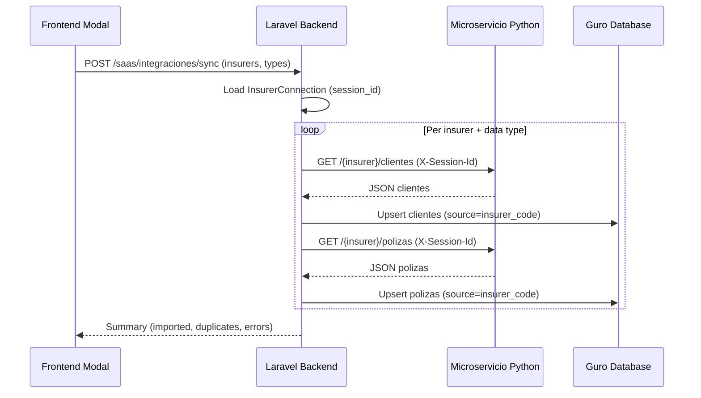

# Paso 2 - Modal de Sincronizacion de Informacion

## Architecture Overview



## Frontend: Full-screen Sync Modal

File: [frontend/src/views/inicio/Inicio.tsx](frontend/src/views/inicio/Inicio.tsx)

The "Empezar" button on Step 2 opens a full-screen modal (rendered via `createPortal`, same pattern as `ApisAseguradoras.tsx`).

### Modal Wizard Stages

**Stage 1 - Select insurers**: Shows only connected insurers as checkboxes with their logos. Each card shows insurer name, "connected" badge, and a checkbox. A left sidebar says "Sincroniza tu informacion" (same style as connection modal sidebar).

**Stage 2 - Select data types**: Three toggle cards:
- "Clientes" - icon: `solar:users-group-rounded-linear`
- "Polizas" - icon: `solar:shield-check-linear`  
- "Cartera" - icon: `solar:wallet-money-linear`
Each card has a description and a toggle/checkbox.

**Stage 3 - Syncing animation**: Same visual style as the connection modal (Guro logo on left, dashed animated line, insurer logo on right), but with a progress list below showing each insurer being synced. Each row shows: insurer logo, name, data type being synced, spinner or checkmark. Real-time progress as the backend processes.

**Stage 4 - Success**: Confetti, summary stats (X clientes importados, Y polizas importadas, Z items cartera), "Ver clientes" and "Ver polizas" buttons.

### Step 2 card changes in Inicio.tsx
- Text changes to: "Sincroniza tu informacion"
- Description: "Importa clientes, polizas y cartera de tus aseguradoras conectadas."
- Button: "Empezar" opens the modal instead of navigating to `/apps/seguros/polizas`

## Backend: Sync Controller + Service

### New Controller
File: `backend/app/Http/Controllers/SaaS/InsurerSyncController.php`

- `sync(Request $request)` - Main endpoint. Receives `{ insurers: ['sura','hdi'], types: ['clientes','polizas','cartera'] }`. For each insurer+type combination, fetches from the microservice and upserts into Guro DB. Returns summary.
- `preview(Request $request)` - Optional: returns counts of what would be synced without importing.

### New Service  
File: `backend/app/Services/InsurerSyncService.php`

Core logic extracted from existing `SuraScraperController::importClients` pattern but generalized for all insurers:

- `syncClientes(InsurerConnection $conn)` - Calls microservice `GET /{insurer}/clientes` with session_id, normalizes response per insurer, upserts into `clientes` table with `source` = insurer_code. Duplicate detection by `(broker_id, document_number)`.
- `syncPolizas(InsurerConnection $conn)` - Calls microservice `GET /{insurer}/polizas`, normalizes, upserts into `polizas` table. Links to existing clients by document number.
- `syncCartera(InsurerConnection $conn)` - Calls microservice `GET /{insurer}/cartera`, normalizes, stores cartera items.
- Uses `MicroservicioInsurerService` HTTP client with the stored `microservice_session_id` as `X-Session-Id` header.

### Normalization
Each insurer returns different field names. The service maps them to Guro's schema:
- Sura: `nombreCliente` -> `nombre`, `dniCliente` -> `numero_documento`, etc. (already done in `SuraScraperController::normalizeCliente`)
- HDI: `holder.full_name` -> `nombre`, `holder.id_number` -> `numero_documento`
- Bolivar: similar mapping from microservice response
- AXA: `nombreCompleto` -> `nombre`, `identificacion` -> `numero_documento`

### Route
Add to `backend/routes/api.php` inside the `integraciones/aseguradoras` group:

```php
Route::post('/sync', [InsurerSyncController::class, 'sync']);
```

### Frontend Service
Add to [frontend/src/services/saasApi.ts](frontend/src/services/saasApi.ts):

```typescript
async syncInsurers(insurers: string[], types: string[]): Promise<ApiResponse<SyncResult>> {
  const response = await fetch(`${API_BASE_URL}/saas/integraciones/aseguradoras/sync`, {
    method: 'POST',
    headers: await this.getAuthHeaders(),
    body: JSON.stringify({ insurers, types }),
  });
  return this.handleResponse(response);
}
```

## Key Design Decisions

- **Upsert strategy**: Use `updateOrCreate` keyed on `(broker_id, document_number)` for clients and `(broker_id, numero_poliza, insurer_code)` for policies to avoid duplicates
- **Source tracking**: Store `source` field on imported records (e.g. `sura_sync`, `hdi_sync`) to differentiate from manually created records
- **Timeout**: Set `set_time_limit(300)` on the sync endpoint since it may process hundreds of records across multiple insurers
- **Error resilience**: If one insurer fails, continue with the others and report partial results
