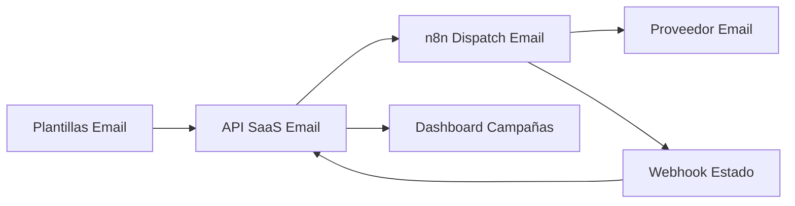

# Arquitectura Fase 1: Campañas de Email con n8n

Alcance acordado
- Canal: Email (exclusivo en Fase 1)
- Audiencias: segmentos y CSV
- Límite: 30 emails/min
- Ventana: 08:00-20:00 local
- n8n: detrás de reverse proxy con Bearer
- Métricas: dashboard dedicado

Integración actual en frontend
- La ruta UI /apps/marketing/plantillas carga el módulo de plantillas. Implementaremos el consumo real vía:
  - [campaignTemplateService.ts](frontend/src/services/campaignTemplateService.ts:105)
  - [CampaignTemplatesManager.tsx](frontend/src/components/campaigns/CampaignTemplatesManager.tsx:67)
- Backend aún no publica /saas/campaign-templates en [api_secure.php](backend/routes/api_secure.php:311)

Contrato API propuesto (Backend Laravel)
Base: /api/saas

1. Plantillas de campaña (solo email en Fase 1)
- GET /campaign-templates?category&search&active
  - Respuesta: { success, data: CampaignTemplate[] }
- GET /campaign-templates/{id}
  - Respuesta: { success, data: CampaignTemplate }
- POST /campaign-templates
  - Body: { name, content, category, description?, variables?, is_active? }
  - Respuesta: { success, data: CampaignTemplate }
- PUT /campaign-templates/{id}
  - Body: parcial de POST
  - Respuesta: { success, data: CampaignTemplate }
- DELETE /campaign-templates/{id}
  - Respuesta: { success }
- POST /campaign-templates/{id}/duplicate
  - Respuesta: { success, data: CampaignTemplate }
- GET /campaign-templates/categories
  - Respuesta: { success, data: Record<string,string> }
- POST /campaign-templates/{id}/preview
  - Respuesta: { success, data: { template, preview_content, sample_data } }

2. Campañas de email
- POST /email-campaigns
  - Body mínimo:
    {
      name: string,
      description?: string,
      template_id?: string,
      subject?: string,
      content?: string, // requerido si no hay template_id
      audience: {
        segment_id?: string,
        csv_upload_id?: string
      },
      throttling: { per_minute: number }, // default 30
      send_window: { start: "08:00", end: "20:00", timezone?: string }
    }
  - Respuesta: { success, data: { id, status: "draft"|"scheduled"|"running", ... } }
- POST /email-campaigns/{id}/start
  - Dispara workflow n8n. Respuesta: { success, execution_id }
- GET /email-campaigns?status&limit&offset
  - Respuesta: { success, data: Campaign[], total }
- GET /email-campaigns/{id}
  - Respuesta: { success, data: Campaign }
- GET /email-campaigns/{id}/status
  - Respuesta: { success, data: { status, sent, delivered, failed, ... } }
- GET /email-campaigns/{id}/recipients?status
  - Respuesta: { success, data: Recipient[] }
- POST /email-campaigns/uploads  // carga CSV
  - multipart/form-data: file
  - Respuesta: { success, upload_id, detected_columns: string[], sample_rows: any[] }

3. Webhooks de estado (n8n -> backend)
- POST /webhooks/n8n/email-status
  - Header: Authorization: Bearer N8N_BEARER_TOKEN
  - Body: { campaign_id, recipient: { id?, email }, status: "sent"|"delivered"|"failed"|"opened"|"clicked", provider_message_id?, error?, timestamps? }
  - Respuesta: { success }

Esquema de datos (resumen)
- campaign_templates:
  - id (uuid), name, content (text), category (string), description (text nullable),
    variables (json), variables_list (array derivada), is_active (bool), is_default (bool),
    usage_count (int), broker_id (fk multi-tenant), created_at, updated_at
- email_campaigns:
  - id (uuid), name, description, template_id (fk nullable), subject (string nullable), content (text nullable),
    audience_type ("segment"|"csv"), segment_id (nullable), csv_upload_id (nullable),
    throttling_per_minute (int default 30), window_start ("08:00"), window_end ("20:00"), timezone (string),
    status ("draft"|"scheduled"|"running"|"paused"|"completed"|"failed"),
    stats_json (json), broker_id, created_by, created_at, updated_at
- email_campaign_recipients:
  - id (bigint), campaign_id (fk), email (string), name (string nullable),
    variables_resolved (json), status ("pending"|"sent"|"delivered"|"failed"|"opened"|"clicked"),
    provider_message_id (string nullable), last_error (text nullable),
    sent_at, delivered_at, opened_at, clicked_at, created_at, updated_at
- uploads_csv:
  - id (uuid), filename, storage_path, size_bytes, detected_columns (json), mapping (json),
    total_rows, valid_rows, error_rows, sample_rows (json), broker_id, created_by, created_at
- webhook_logs:
  - id (bigint), source ("n8n"), event_type, headers_masked (json), payload (json),
    received_at, processed_at, status_code, error_message (nullable)

Validaciones y reglas
- Solo usuarios con permiso plantillas_campana pueden crear/editar plantillas/campañas.
- Previo a start: validar
  - que hay subject+content efectivo (template_id o content)
  - que la audiencia resuelve al menos 1 destinatario válido
  - que las variables del template están definidas en variables_resolved
- Anti-spam:
  - Enviar solo dentro de ventana 08:00-20:00 (backend valida y n8n refuerza)
  - Throttling 30/min configurable por campaña con tope por rol, p.ej. <= 60

Integración n8n
Variables entorno en backend:
- N8N_BASE_URL
- N8N_BEARER_TOKEN

Workflow Dispatch Email Campaign (n8n)
- Trigger: Webhook protegido por Bearer. Input: { campaign_id }
- Fetch Campaign Data: HTTP GET backend /api/saas/email-campaigns/{id}
- Resolver audiencia:
  - Si segment_id: HTTP GET a endpoint del backend que retorna emails
  - Si csv_upload_id: HTTP GET backend para stream/lista paginada
- Rate limit: 30/min
- Ventana horaria: condición que solo procese entre 08-20 (timezone del broker)
- Envío de correo: usar SMTP o SendGrid/Mailgun node según configuración global del n8n
- Reporte estado: HTTP POST a /api/webhooks/n8n/email-status por cada evento
- Reintentos: backoff exponencial hasta 3

Seguridad y permisos
- Rutas bajo middleware unified.auth, global.broker.auth y saas.auth
- Mapear permiso plantillas_campana para la UI [/apps/marketing/plantillas](frontend/src/utils/permissionUtils.ts:36)
- Webhook n8n exige Authorization Bearer y validación de estructura

UI y dashboard
- La página de plantillas usará CampaignTemplatesManager en modo Email únicamente.
- Añadir un botón Crear campaña desde plantilla que abra wizard:
  - Paso 1: audiencia (segmento o CSV), Paso 2: asunto y contenido preview, Paso 3: límites y ventana
- Dashboard dedicado: lista de campañas, estado, métricas; polling GET /email-campaigns y /status

Diagrama de flujo

Roadmap de implementación
- Backend: agregar rutas /saas/campaign-templates y /saas/email-campaigns en [api_secure.php](backend/routes/api_secure.php:155)
- Backend: crear controladores SaaS para plantillas y campañas, y servicio AudienceResolver
- Backend: cliente n8n con Bearer y disparador de workflow
- Frontend: adaptar [Plantillas.tsx](frontend/src/views/apps/marketing/plantillas/Plantillas.tsx:33) para usar el manager real y añadir wizard
- n8n: construir workflow y configurar credenciales SMTP o proveedor
- QA: pruebas con segmento pequeño y CSV, dry-run y validación en dashboard

Notas de compatibilidad
- Respetar los contratos del servicio en [campaignTemplateService.ts](frontend/src/services/campaignTemplateService.ts:105) para evitar cambios de front
- Si se requiere subject por plantilla, se agregará como campo opcional sin romper la UI actual